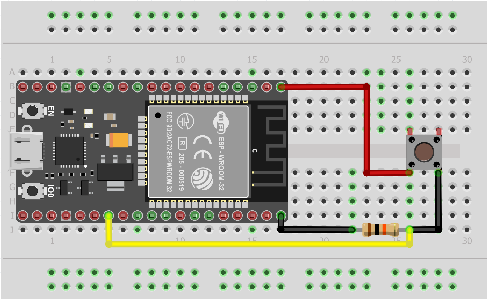
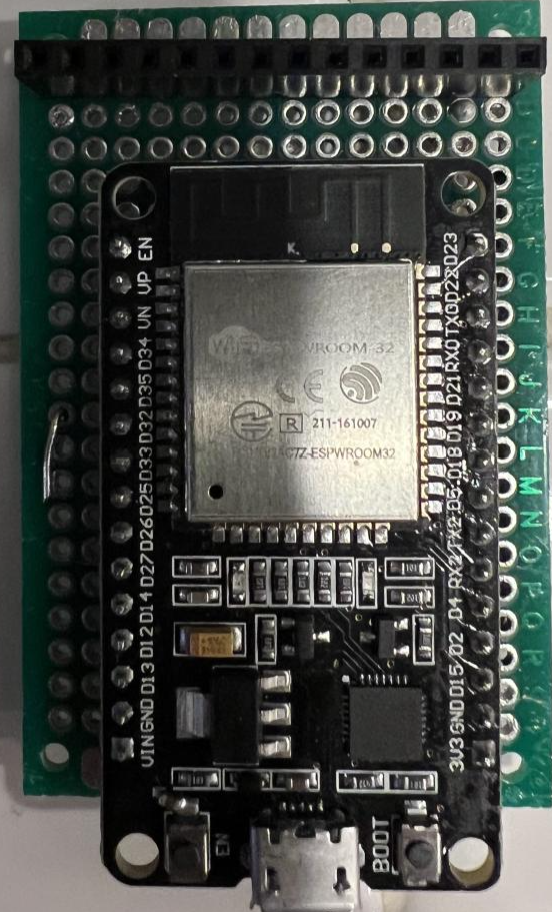
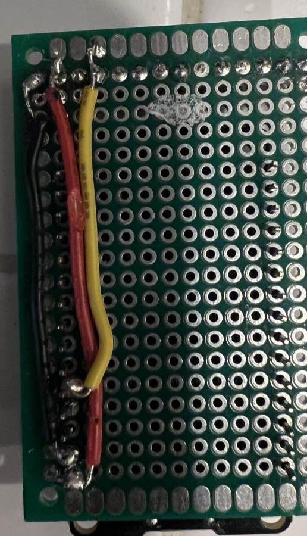
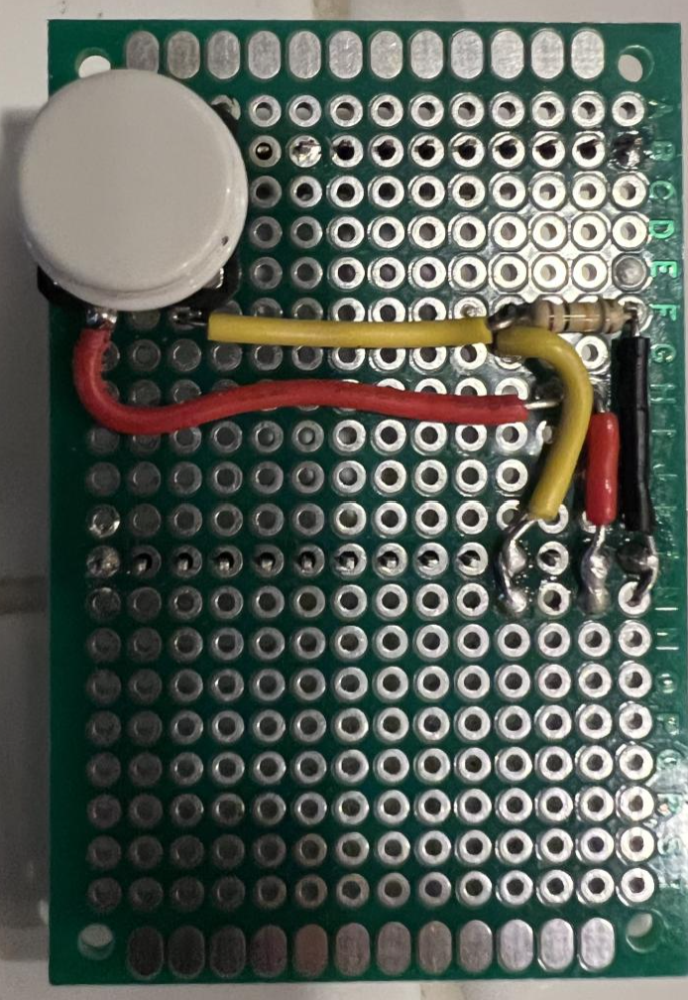
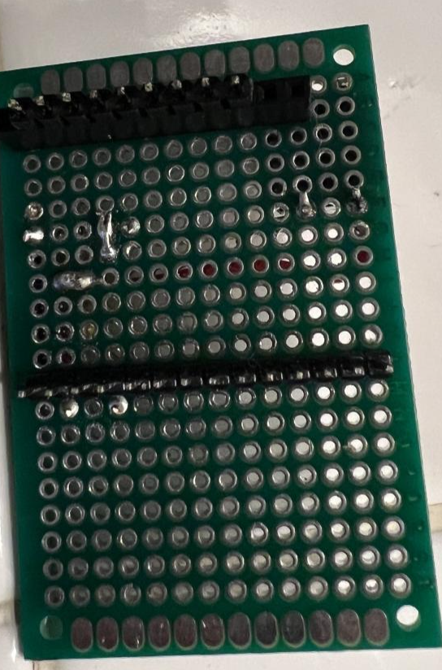
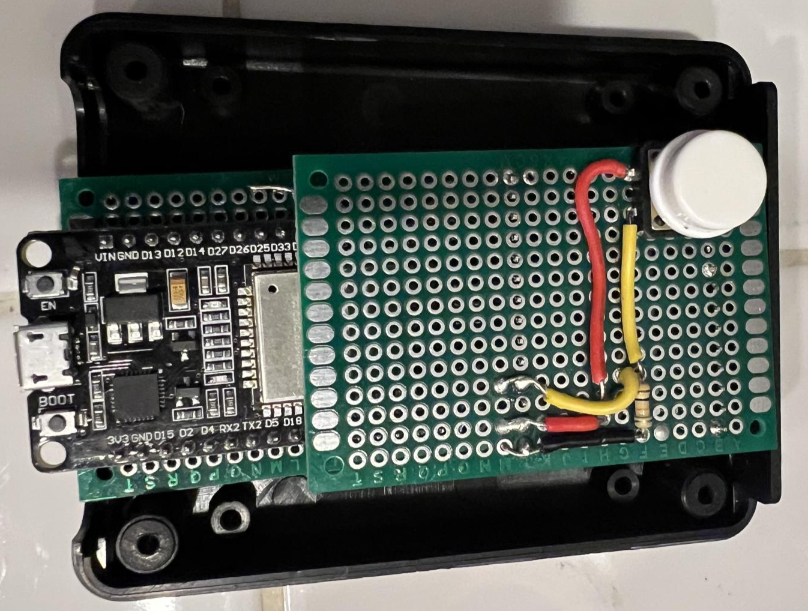
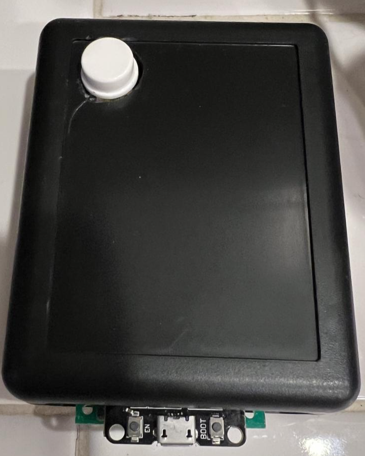

# Controlling Home Automation Scenes with ESP32 and MQTT
Using the ESP32 with Micropython and momentary switch for MQTT communication to control scenes

## The Problem (background because everyone needs to hear my life story)
I have been lightly tinkering with home automation for about a decade.  My initial deployment used proprietary (brand-specific) RF smart devices for climate and lighting control, but as its aged, it has become unstable, and lights will turn on/off on their own.  Prices for smart devices have come down significantly since I first started, and they've become more capable.  Adding to that the fact that there are many more options for a central processor available, I've gone about incrementally swapping out and modernizing my troublesome devices.

In addition to the automations I have set up, there are a number of ways in which the people in my house can interact with our smart devices such as voice assistants, phone/tablet/browser, physically touching devices like barbarians, etc.  My girlfriend is not a fan of voice assistants, though, and doesn't want to have to dig out her phone to control a device.

Couple this aversion with an odd design in our house (our upstairs landing only has light switches upstairs), and we have a problem when she wants to go upstairs without having to dig her phone out or simply ask Alexa to turn it on.  Previously, this problem was solved with a scene switch - but as previously mentioned, this has become unstable/unreliable.

## The Solution
As times and technology have changed, I have dug in deeper to the home automation world, and have moved away from proprietary controllers and smart devices to a more configurable and generic approach.  I'm currently running [Home Assistant](https://www.home-assistant.io/) on a Raspberry Pi for my home control, and am loving it!  It has facilitated and simplified my move to a more modern and stable home configuration.

Because it can publish and subscribe to MQTT events, it seemed like leveraging that to create a physical interface that was network connected was a great approach.

I selected an ESP32 with a momentary switch button as the driving interface because a) I love these things; and b) my girlfriend loves the satisfying "click" she gets when interacting with physical devices.  Because it can later be expanded as a full scene controller, there's also some potential promise for her to use it for something different.

## The Circuit

The circuit is extremely simple, currently using just one button and a 10k Ω resistor.  
### Parts List
- ESP32 WROOM Dev Board (I used one of [these](https://www.amazon.com/dp/B07QCP2451?psc=1&ref=ppx_yo2ov_dt_b_product_details))
- Momentary switch button(s)
- 10k Ω resistor(s)
- Breadboard or PCB
- Some jumper wires
I've wired mine to use GPIO pin #4 on my ESP32:

I use the onboard LED (pin #2) as a way of communicating status for things like connections to the WiFi and MQTT broker.

## Watch Your Mouth - Such Language!
I chose to use micropython based solely on personal preference - Arduino C would work fine, too, but I find I code faster and can read better with python, so I flashed the ESP32 to use its firmware instead of firing up the Arduino IDE and coding there.

## Configuration
Rename or copy the `config.example` to `config.py` and update the values for your own configuration (network, MQTT broker address, circuit pins, etc).

## Et voila!
While my soldering skills clearly leave a bit to be desired, and my project's box cracked while drilling a hole for the scene controller, I'm overall happy with how this turned out.  To fill the box, I used male and female headers to connect my PCB prototype boards, and an additional set of headers at the top of the button's PCB to keep it from depressing too far/allowing sufficient tension to depress the button instead of the board:

